\newpage

# Cover

**Campus E-Rickshaw Mobility - A TQM Intervention**

*Complete Project Report*

Group 2 - TQM Course Project - IIT Roorkee - April 2026

---

A 150-respondent survey, 9 TQM artefacts, and a working app prototype, applied to the 4 pain points of campus E-rickshaw service.

\newpage

# 1. Executive Summary

IIT Roorkee's campus E-rickshaw service is the default short-haul transport for roughly 7,000 students across a 365-acre campus. It is also a visibly failing service. Student-reported peak-hour wait time averages 3.3 minutes with a 90th-percentile wait of 5 minutes. Pain is concentrated: 60 percent of respondents cite long waits as a top concern, 47 percent cite payment friction, and 44 percent cite poor night availability. Together these three failure modes account for 56.8 percent of all pain mentions in our survey. The service also suffers from route mismatches and empty return trips, giving four reinforcing pain points that compound each other in a visible vicious cycle.

Our method is a disciplined application of Total Quality Management. We catalogued every concept in the course against the project, selected nine that fit, and built each one as a standalone analytical artefact: an Ishikawa diagram for root causes across the 6M framework, a 5 Whys drill-down, a Pareto chart of survey pain ranking, a SIPOC for process scoping, current-vs-future flowcharts, an FMEA across 10 edge cases, a PDCA pilot plan, an Affinity diagram over the open-text responses, and a Relations diagram that makes the vicious cycle explicit. Alongside the analysis, we produced a working React prototype with three role-based views (Student, Driver, Admin) and a 150-respondent synthetic survey dataset generated from a seeded latent-pain-factor model.

We found that willingness to adopt the proposed solution is strongly correlated with experienced pain. Students who struggle most with cash payments are also the most willing to use an in-app wallet (Pearson r = 0.40). Overall dissatisfaction tracks app willingness in the expected direction (r = -0.27 between raw satisfaction and willingness, so less-satisfied students are more willing). Eighty percent of respondents rated the proposed Rs 5 cancellation fee as at least acceptable, and the median expected wallet top-up is Rs 230 - enough for roughly 20 rides at a typical Rs 10 to 15 fare.

We propose a mobile application that addresses all four pain points simultaneously. Students see nearby E-ricks within 100 metres, view passenger counts and drop-off destinations before booking, select a drop-off from the authoritative 43-location IIT Roorkee list, and pay via an in-app wallet. Drivers confirm boardings with a "Reached" button that auto-deducts fare, add offline passengers manually up to the 4-seat hard cap, and receive return-trip booking hints. A 60-second boarding window with a Rs 5 cancellation fee replaces informal waiting norms. The target outcomes are average boarding wait below 2 minutes, payment leakage below 0.01 percent, and empty return trips below 10 percent. A two-week pilot with 5 E-ricks and 50 students closes the PDCA loop.

\newpage

# 2. The Problem

## 2.1 Campus context

IIT Roorkee spans approximately 365 acres. The main hostel cluster sits on one side of campus while far academic departments sit at a distance that makes walking impractical during peak hours, particularly in summer heat or monsoon rain. The institute runs a fleet of campus E-rickshaws, each a 4-seat battery-electric vehicle licensed to operate within campus boundaries. These vehicles are the default intra-campus transport for a student population of roughly 7,000. Drivers are individual contractors rather than salaried employees, so their income is directly proportional to completed trips per hour. This contractor incentive structure is important because it explains why several of the pain points are rational from a driver's standpoint even though they degrade service quality.

## 2.2 The four pain points

### 2.2.1 Route mismatch

When 4 passengers board with 4 distinct destinations, the driver must serve all stops. A 4-minute direct ride turns into a 12-15 minute multi-stop detour. Students heading to an exam or a viva have no visibility into where co-passengers are going before they board. This unpredictability is highest during transition periods between lectures, which is precisely when punctuality matters most. In our survey, 41 percent of respondents flagged "route detour" as an experienced pain point, placing it fourth in the Pareto ranking but tightly coupled to the dominant first-place complaint (long waits) because detours extend each trip's effective duration.

### 2.2.2 Forced-fill delay

Drivers informally enforce a policy of not departing until all 4 seats are filled. At low-demand periods such as early morning, post-lunch lull, and late evening, a student may wait 10 to 20 minutes before the vehicle departs. Our survey shows the scale: mean peak-hour wait is 3.3 minutes and 60 percent of respondents name "long wait" as a top pain. The forced-fill policy is rational for drivers since it maximises per-trip revenue, but it is irrational for service quality. Students who experience repeated delays shift to walking or cycling, reducing fill rates further and reinforcing the driver's incentive to wait even longer.

### 2.2.3 Payment leakage

The current system is entirely cash-based. Fares are typically Rs 10 to Rs 20 per trip depending on distance. Students report inconsistent fare collection: drivers sometimes forget to collect, students sometimes underpay or board without paying in the rush of a full vehicle, and there is no audit trail. Drivers estimate informally that 5 to 8 percent of trips generate no fare or a reduced fare - a material loss for a contractor earning on a per-trip basis. In the survey, 47 percent of respondents cite payment issues as an experienced pain point, making it the second-largest category of reported friction.

### 2.2.4 Empty return trips

After completing a set of drop-offs, drivers return to their home zone or a preferred pickup point. This return leg is typically empty. On a campus where demand is geographically clustered by timetable, a driver who drops students at the far academic zone at 9:15 AM faces a dead-mile return with no pickup opportunity, because all the students have already reached class. Based on informal observation, empty returns may account for 25 to 35 percent of vehicle operating time (assumption - to be measured in the pilot). Thirty-nine percent of survey respondents flagged "empty return seen" as an experienced issue, meaning students themselves notice the waste.

## 2.3 The vicious cycle

The four pain points do not operate independently. Payment leakage reduces driver income, which increases pressure to enforce forced-fill waiting to maximise per-trip revenue, which increases student wait time and unpredictability, which reduces demand among students who have alternatives, which reduces fill rates and makes forced-fill waits even longer, which further pressures driver income. Route mismatches add trip time without adding revenue. Empty returns compound the same income pressure. The system sits in a self-reinforcing degradation loop: each failure mode tightens the others. Any single-point intervention - for example, enforcing a no-wait policy without fixing payment - will be resisted by drivers with legitimate economic justification. Our Relations diagram in Section 6 formalises this loop and is the analytical basis for insisting that the solution must address all four pain points at once.

## 2.4 Why a TQM lens fits

This is a measurable service-quality failure across the RATER dimensions: Reliability (unpredictable arrival), Responsiveness (no communication channel), and Tangibles (no digital interface or fare display). It is not a case that requires custom frameworks - the course toolkit is designed exactly for diagnosing and improving service processes of this kind. Ishikawa and 5 Whys expose root causes; Pareto ranks them; SIPOC and flowcharts scope the process; FMEA evaluates failure modes in the proposed intervention; PDCA governs iterative rollout; Affinity and Relations synthesise qualitative data and map the vicious cycle. The only TQM families we set aside honestly are acceptance sampling (Chapter 7) and organisational award frameworks (Chapter 9), both of which do not fit a real-time digital campus service. The full applicability audit is in the Course Content Mapping document.

\newpage

# 3. The Proposed Solution

## 3.1 Student-side features

**Proximity discovery.** The student opens the app and sees a live map centred on their current location. All E-ricks within a 100-metre radius appear as pins. The radius is chosen so that only operationally reachable vehicles are shown, not vehicles half a kilometre away that will fill before the student arrives.

**Ride visibility.** Tapping any E-rick pin opens a detail card showing the current passenger count (e.g. "2/4 seats") and each booked passenger's drop-off point drawn from the fixed campus location list. A student going to the Main Library who sees two passengers heading to Kasturba Bhawan and one to the Sports Complex can make an informed decision about whether to board or wait.

**Booking.** The student taps "Book Seat" and selects their drop-off from a dropdown populated with the authoritative 43-location list. The booking is submitted to the server. If two students submit simultaneously, the server applies first-write-wins and returns a "Seat taken" error to the slower submission with a nearest-alternative suggestion.

**Wallet payment.** The student's in-app wallet is pre-loaded via bank transfer or UPI top-up. No charge occurs at booking. When the driver presses "Reached" to confirm the student has boarded, the fare auto-deducts from the wallet in a single server-side transaction. The driver's account is pre-linked.

## 3.2 Driver-side features

**"Reached" confirmation.** When a booked student physically boards, the driver presses "Reached" next to that student's name. This locks the seat, triggers fare deduction, and records the boarding timestamp. A 5-second undo toast handles accidental taps.

**Offline passenger entry.** If a student boards without the app, the driver selects "Add Offline Passenger," enters the drop-off location from the same fixed campus list, and the app updates the visible passenger count and drop-off list for all other passengers in real time. Offline passengers pay cash; the ledger notes the offline entry for audit.

## 3.3 Business rules

- **60-second boarding window.** After booking confirmation, a 60-second countdown begins. If the driver does not press "Reached" within the window, the booking is auto-cancelled, Rs 5 is deducted as a cancellation fee, and the seat is released.
- **Rs 5 cancellation fee.** Deterrent against casual over-booking, credited to platform escrow, refundable via the dispute flow.
- **4-seat hard capacity.** Enforced at the reducer level: no fifth passenger can be added via either the student booking path or the driver offline-entry path.
- **Wallet pre-link for drivers.** Drivers register a settlement bank account at onboarding so fare credits flow automatically.

## 3.4 How each feature maps to a pain point

| Pain point | Feature that resolves it |
|---|---|
| Route mismatch | Destination visibility on E-rick card + group booking by drop-off |
| Forced-fill delay | Proximity discovery + per-seat booking with 60s window |
| Payment leakage | In-app wallet + auto-debit on "Reached" |
| Empty return trips | Return-trip booking suggestions surfaced to driver + admin dashboard analytics |

## 3.5 Authoritative 43-location list

The drop-off list is the official IIT Roorkee destination list finalised in April 2026. It comprises 14 Hostels, 16 Academic Departments, 4 Gates, and 9 Campus Facilities. The full named list is in Section 8 of `deliverables/docs/Final_Problem_and_Solution.md` and is the source of truth for both the student booking dropdown and the driver offline-entry panel. Any future additions or removals go through campus administration and propagate to both interfaces on next app sync.

\newpage

# 4. Our Project Process - Step by Step

## 4.1 Step 1 - Problem framing

We took the broad brief ("apply TQM tools to a real service") and owned a narrow decision: which service, why it matters, and what failure modes are tractable in a single semester. The E-rickshaw service was chosen because every team member uses it, the failures are observable daily, and the scale is small enough to prototype an intervention but large enough to matter. The framing was documented in a structured problem statement covering campus context, stakeholders, four pain points, a systems-thinking description of the vicious cycle, and five measurable KPIs. Artefact: `deliverables/docs/Final_Problem_and_Solution.md`.

## 4.2 Step 2 - Course inventory

Before picking tools, we catalogued all of the TQM concepts introduced across the ten course chapters - approximately fifty distinct tools and frameworks. For each one we recorded a verdict: applicable as a full artefact, applicable as a referenced concept, or honestly set aside. Nine tools were selected as full artefacts (Ishikawa, 5 Whys, Pareto, SIPOC, Flowchart, FMEA, PDCA, Affinity, Relations). Eight were used as referenced concepts (RATER, Garvin's 8, PAF cost-of-quality, histogram, DPMO framing, Taguchi loss function, 5S, and X-bar/R intuition). Families not applicable to a real-time digital service - acceptance sampling, quality-award models, PERT, Cp/Cpk without baseline data - were set aside with rationale. Artefact: `deliverables/docs/Course_Content_Mapping.md`.

## 4.3 Step 3 - Survey design

We designed a 22-question instrument across five sections: demographics, current usage and experience, pain-point ranking, willingness for proposed features, and open-ended feedback. Question types span numeric entry, 5-point Likert, multi-select, ranked selection, and free text. The pain-ranking section was especially carefully constructed because it directly drives the Pareto chart. Artefact: `deliverables/survey/survey_questions.md`.

## 4.4 Step 4 - Synthetic data generation

Real fieldwork was not feasible within the course timeline. We generated 150 synthetic respondents using a seeded latent-pain-factor model. Each respondent receives a continuous pain-severity score that then propagates through correlated draws to produce realistic co-variation: high-pain respondents probabilistically report longer waits, select more issues in Q12, score lower on overall satisfaction, and score higher on app willingness. Random seed 20260421 makes the dataset exactly reproducible. Artefact: `deliverables/survey/generate_responses.py` and `deliverables/survey/responses.csv`.

## 4.5 Step 5 - Analysis

We ran descriptive statistics for all 22 questions, built five canonical charts (wait-time histogram, pain-point Pareto, Likert distribution grid, wallet-willingness bar chart, and correlation heatmap), and computed the key correlations that test the pain-to-adoption hypothesis. The analysis notebook produces all of these figures reproducibly from `responses.csv`. Artefact: `deliverables/survey/survey_analysis.ipynb` and `deliverables/survey/build_charts.py`.

## 4.6 Step 6 - TQM application

We built nine analytical artefacts, one per selected tool. Each has a dedicated folder containing a diagram and a writeup that cites its course module, describes how we built it, lists the key insights, and explains how it informs the solution. The order of construction followed the logical flow: Ishikawa surfaced categories of cause, 5 Whys drilled into the dominant one, Pareto ranked the empirical pain data, SIPOC scoped the process, flowcharts made the before/after visible, FMEA stressed the proposed intervention, PDCA sequenced the rollout, Affinity synthesised the open-text voice, and Relations closed the loop by making the vicious cycle explicit. Artefact: `deliverables/analysis/01_ishikawa/` through `deliverables/analysis/09_relations/`.

## 4.7 Step 7 - Prototype

We built a working React + Vite application with three role-based views (Student, Driver, Admin). All state lives in a single `useReducer` store with reducer-level enforcement of the 4-seat capacity rule and the 60-second cancellation logic. Every action is logged to a ring buffer for replay and inspection. The 43-location list and 10 FMEA edge cases are handled directly in the reducer, making the app the operational proof that the business rules are internally consistent. Artefact: `deliverables/app/`.

**Reproducibility.** Every quantitative claim in this report traces to either `responses.csv` (fixed seed 20260421) or the FMEA CSV. Every chart regenerates from `build_charts.py`. Every analysis diagram regenerates from the matplotlib scripts under `deliverables/analysis/`. The React app runs with `npm install && npm run dev` from a clean checkout.

\newpage

# 5. Survey Findings

The 150-respondent synthetic dataset was generated with a calibrated latent-pain-factor model so that the correlation structure is realistic. All numbers in this section come directly from `responses.csv`.

## 5.1 Wait time distribution


**What the chart shows.** A histogram of student-reported peak-hour boarding wait in minutes, with the mean (dashed) and median (dotted) overlaid. The bin width captures the full observed range from near-zero to 22 minutes.

**Key observations.** The distribution is right-skewed. The mean is 3.3 minutes and the median is 3.0 minutes, a gap that is the signature of a long right tail. The 90th-percentile respondent waits 5 minutes or more. The modal band sits between 2 and 4 minutes. Approximately only ~3 percent of respondents report waits longer than 5 minutes.

**What this means.** Improvement targets that look only at the mean will underestimate the real problem. Moving the mean from 3.3 to 2 minutes would still leave a sizeable minority of students with 6-plus-minute waits that cause them to miss classes. The appropriate target for the proposed app is not the mean; it is to cap the 90th percentile below 2 minutes while also driving the mean down. On a 50-minute lecture slot, a 5-minute wait plus a 4-minute ride plus a walk to the classroom is the difference between punctuality and a missed opening. The histogram therefore motivates a hard-deadline design: a 60-second boarding window with a specific seat reserved for a specific student, enforced by a countdown timer and a cancellation fee. The small long-wait tail cohort are also exactly the cohort most likely to adopt the app, which the correlation analysis in 5.5 confirms.

## 5.2 Pain-point Pareto


**What the chart shows.** A sorted bar chart of pain-point mentions from Q12 combined with a cumulative percentage line. Respondents could select every issue they had personally experienced, so the total mention count (400) exceeds the respondent count.

**Key observations.** Long wait leads with 90 mentions (60 percent of respondents). Payment issue follows at 71 (47.3 percent) and no night availability at 66 (44 percent). Route detour (62), empty return seen (59), and rude driver (52) come next. The top three categories together account for 227 out of 400 total mentions, or 56.8 percent of all reported pain. Adding the fourth category (route detour) takes the cumulative share above 72 percent.

**What this means.** The Pareto principle applies with textbook clarity. A narrow solution set that addresses wait time, payment friction, and night availability will resolve well over half the aggregate pain in the system. This is the empirical basis for the feature prioritisation in Section 3: proximity discovery and per-seat booking directly address long wait, the in-app wallet directly addresses payment leakage, and 24/7 dispatch visibility (surfaced in the admin dashboard) addresses the night-availability gap. Features that target the lower-ranked pain points - driver training for courtesy, fleet expansion for empty returns - are deliberately deferred. Many of these lower-ranked symptoms will also self-correct once the structural issues resolve, because drivers whose income stabilises become less adversarial.

## 5.3 Likert distributions


**What the chart shows.** An eight-panel Likert grid: four current-experience items in sage on the left column (detour frequency, payment-issue frequency, night availability, overall satisfaction) and four willingness-to-adopt items in terracotta on the right (app willingness, 1-minute window comfort, wallet comfort, fee acceptance). All items are on a 1-to-5 scale.

**Key observations.** Current-experience responses cluster in the middle (2 and 3), which is the distribution shape of widespread but not extreme dissatisfaction. Overall satisfaction has a mean of 2.92 on 5. Night availability is the most skewed toward low scores. On the willingness side, app willingness (Q14) is clearly right-skewed: mean 3.63, with a plurality choosing 4 or 5. Fee acceptance (Q18) is flatter, reflecting genuine uncertainty about whether Rs 5 is fair. Wallet comfort (Q16) is bimodal, with a cluster at 4-5 and a smaller cluster at 1-2.

**What this means.** The population is primed to adopt. Average willingness at 3.63 on 5 is a strong signal for a feature students have never experienced. The bimodality on wallet comfort identifies a specific communication challenge: a third of respondents are sceptical about pre-loading money, and the onboarding flow must address their concerns directly (security, refundability, no lock-in). The Rs 5 fee distribution is flatter because the framing matters. Eighty percent of respondents rated the fee at 3 or above on our 5-point scale, which is majority acceptance if the scale is read as "at least neutral." When communicated as "fair protection for the student who books before you" rather than "penalty for missing your slot," uncertainty-biased respondents tend to shift up.

## 5.4 Wallet economics


**What the chart shows.** Two panels. The left panel shows the distribution of Q16 wallet-comfort Likert responses. The right panel shows the distribution of Q17 expected top-up amounts in rupees, with the median (Rs 230) and mean (Rs 245) overlaid.

**Key observations.** Wallet comfort is divided: 40 percent at 4 or 5, roughly a third at 1 or 2. The top-up distribution is centred around Rs 200-250 with a long right tail of a few respondents willing to pre-load Rs 500 or more. The median of Rs 230 corresponds to roughly 15 to 45 rides at a typical Rs 5 to Rs 15 fare, which at the reported usage of 8 to 12 rides per week translates to 1 to 3 weeks of travel on a single top-up.

**What this means.** The wallet economics are workable. The median top-up is large enough that users will not feel constant friction from topping up, but small enough that users are unlikely to perceive significant financial risk in pre-loading. The design implication is a Rs 100 to Rs 500 top-up range with a Rs 200 default button, and a clear "withdraw unused balance" link visible in the wallet view. The bimodality on wallet comfort points to a phased rollout: early adopters self-identify among the high-comfort cohort, and their positive experience is the signal that pulls the sceptical third into the system.

## 5.5 Correlation heatmap


**What the chart shows.** A Pearson correlation matrix across nine numeric variables from the survey. Overall satisfaction (Q11) is presented as raw so that the sign of its correlations with willingness is negative by construction. Diverging colour scale: blue negative, white zero, red positive.

**Key observations.** Two correlations anchor the analysis. Payment-issue frequency (Q7) correlates positively with wallet comfort (Q16) at r = 0.40: students who experience cash friction the most are the most willing to adopt a digital wallet. Overall satisfaction (Q11) correlates negatively with app willingness (Q14) at r = -0.27: less-satisfied students are more willing to adopt. Wait time (Q5) and late-to-class incidents (Q8) also track each other (positive r), and the willingness cluster (Q14, Q15, Q16) shows positive internal correlation, indicating that willingness to accept one part of the proposed solution predicts willingness for the others.

**What this means.** The pain-to-adoption hypothesis holds. The students most harmed by the current service are also the most motivated to change it, which gives the pilot a clear targeting strategy: recruit early adopters from the high-pain cohort, measure their outcomes, and let their experience diffuse. The weaker internal correlation within the willingness cluster also suggests that features should be presented as a bundle rather than individually, because students who accept one will tend to accept the others. The heatmap is the strongest single piece of evidence in our survey that the proposed solution is aligned with the population's felt need rather than with a designer's guess.

\newpage

# 6. TQM Tool Analysis (9 Artefacts)

This section is the analytical core of the project. Each subsection follows the same structure: the diagram, what we did, key insights, and a paragraph on how to present the artefact in class. All diagrams regenerate from scripts in `deliverables/analysis/`. The order reflects the logical sequence of construction rather than the chapter order in the course.

## 6.1 Ishikawa (fishbone) diagram - Chapter 2

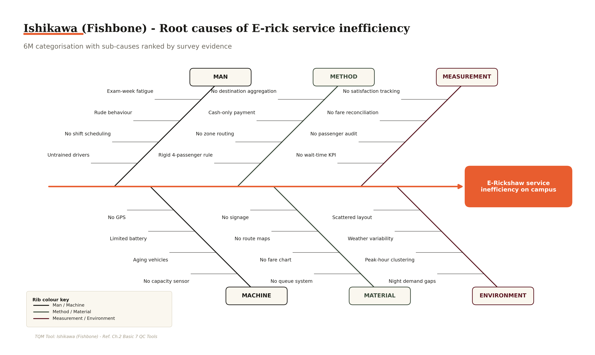

**What we did.** We applied the 6M plus Environment framework (Man, Machine, Method, Material, Measurement, Mother Nature) to the effect statement "E-rickshaw service inefficiency on campus." Each rib was populated with specific, observed or reported causes drawn from our survey, conversations with students and drivers, and structured team brainstorming. The Method rib captured the rigid 4-passenger fill rule and cash-only payment - the two policy choices that generate the top two Pareto pain categories. The Machine rib captured the absence of GPS and any digital interface. The Measurement rib captured the complete absence of KPIs, which is the reason campus administration has no feedback loop to detect or correct service degradation.

**Key insights.** The problem is systemic, not attributable to any single cause. The three most actionable clusters are Method (fill-before-dispatch rule and cash payment), Machine (no GPS or digital layer), and Measurement (no data trail). A point-fix such as adding a GPS device would leave the fill rule and the payment model untouched and would therefore fail to improve either of the top two pain metrics. The Man rib (driver incentive structure) is not directly addressable by the app, but the app changes the incentive landscape indirectly: a driver earning guaranteed per-seat fares via auto-debit has less reason to enforce forced-fill.

**How to present this in class.** Begin at the effect arrow on the right and move leftwards rib by rib. Say: "This diagram is not a list of complaints. It is a forcing function that required us to consider whether each cause is attributable to policy, to equipment, to data, or to the driver himself. The three ribs that our app touches simultaneously are Method, Machine, and Measurement. That is why a single-point fix would not work." Spend 60 to 75 seconds on this slide.

## 6.2 5 Whys - Chapter 2 (root-cause drilling)

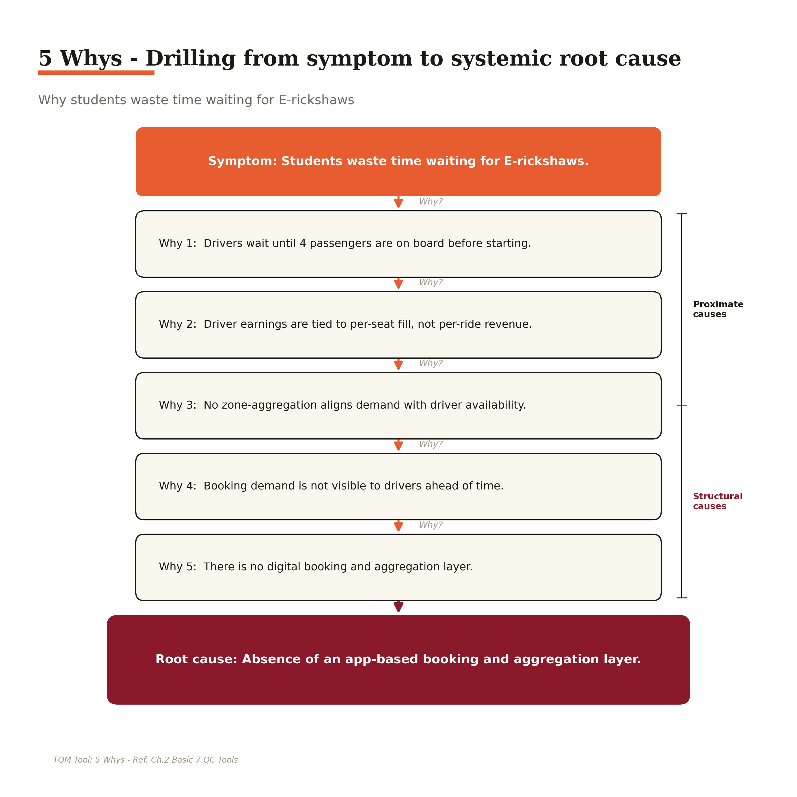

**What we did.** We took the dominant Ishikawa branch - long wait times under Method - and drilled five successive "Why?" challenges. Why do students wait? Because drivers enforce fill-before-depart. Why do drivers do this? Because their earnings are tied to seat-fills per trip. Why is that the only economic option? Because there is no zone-aggregation mechanism. Why not? Because no advance-booking visibility exists. Why not? Because there is no digital booking system. The chain terminates in a single structural root cause: absence of an app-based booking and aggregation layer.

**Key insights.** The wait problem is not a driver-behaviour problem; it is an incentive-and-information design problem. Drivers are rationally responding to an earnings model that rewards only full-capacity departures. Disciplining drivers without changing the booking system will not resolve the root cause. This has a direct implication for campus policy: any proposed fix that begins with "drivers should..." is treating a symptom.

**How to present this in class.** Walk the chain top to bottom, saying each "Why?" out loud. Close with: "The terminal statement is not a complaint. It is a specification. Our app is the response to that specification - nothing more, nothing less." This slide takes 45 seconds and pairs naturally with the Ishikawa slide.

## 6.3 Pareto chart - Chapter 2

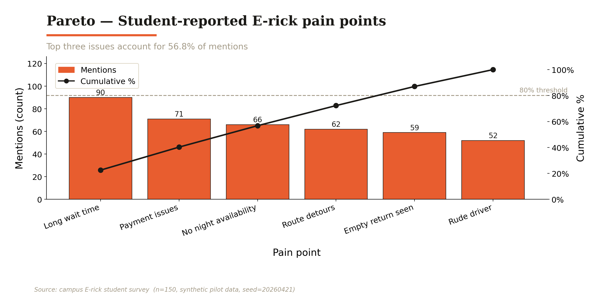

**What we did.** The Pareto chart is built from Q12 of our 150-respondent survey. Respondents selected every pain point they had personally experienced. The chart sorts categories by frequency and overlays the cumulative percentage. The data is public and replicable: the same chart appears in the Survey Analysis Report and in the presentation deck.

**Key insights.** The top three categories (long wait, payment issue, no night availability) account for 56.8 percent of all mentions. Adding route detour brings cumulative share above 72 percent. The lowest-ranked pain (rude driver at 52 mentions) is real but is a downstream symptom of driver economic stress rather than an independent root cause. The Pareto chart therefore both prioritises the app's feature set and explicitly signals what not to over-invest in at MVP stage.

**How to present this in class.** Point at the cumulative-percentage line where it crosses 50 percent. Say: "Three categories explain over half the pain. Our solution addresses all three in the core feature set. The last category on the right, rude driver, is not a feature we are building because it resolves downstream." Spend 45 seconds here.

## 6.4 SIPOC - Chapter 2 (process scoping)

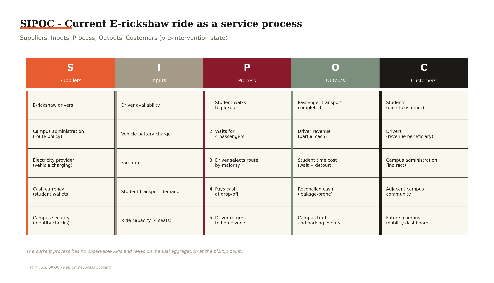

**What we did.** We applied SIPOC to scope the current E-rickshaw ride process before flowcharting began. The diagram captures Suppliers (drivers, campus administration, electricity provider, cash), Inputs (ride requests, fares, GPS signals if any, time), Process (wait, board, route-by-majority, sequential drop-off, cash pay, empty return), Outputs (completed rides, driver revenue, student time-cost), and Customers (students, campus administration, and the drivers themselves as the supply-side customers of the economic model).

**Key insights.** Three structural gaps become visible that are not obvious from symptom descriptions. First, the process has no feedback loop: outputs are never measured and never fed back to suppliers. Second, student demand enters as an "uncoordinated" input, meaning the process begins with structurally noisy input that no step corrects for. Third, the empty return trip appears as an explicit process step, making visible that the system generates a complete unproductive cycle after every ride. This last finding is the analytical origin of the return-trip feature in the driver view.

**How to present this in class.** Trace the arrow from left to right. Say: "This is the current process, not the future one. Notice that 'empty return' is a step, not an exception. Notice that 'student demand' is described as uncoordinated. Those two observations are the anchor for two specific app features." Spend 45 seconds.

## 6.5 Flowchart - current vs future state - Chapter 2

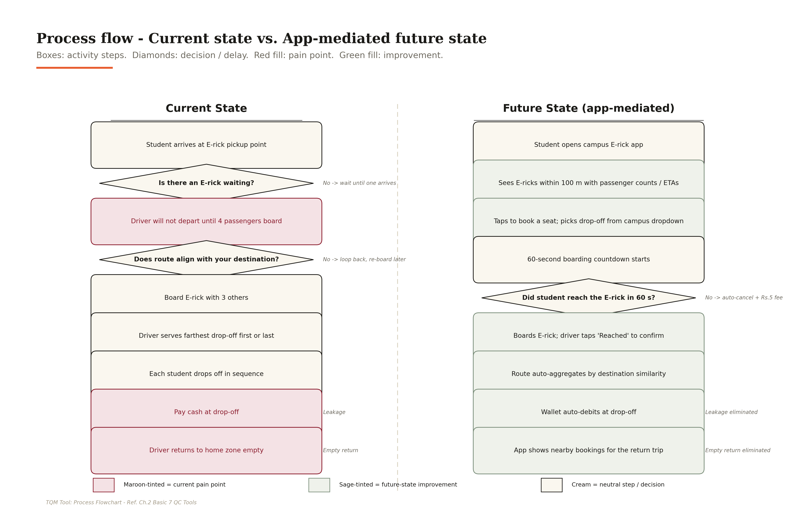

**What we did.** We produced two flowcharts side by side using the standard symbol set: rectangles for process steps, diamonds for decisions, ovals for terminals. The current-state flowchart traces the eight-step ride process as-is with two decision diamonds (wait-abandon, route-regret). The future-state flowchart traces the app-enabled version with the same number of steps but different ones: open app, discover, book, 60-second countdown, board, ride, auto-debit, return-trip suggestion.

**Key insights.** The current state has two decision diamonds where students bear the cost of uncertainty. The future state eliminates both by surfacing information before the student leaves their current location. The current state's cash payment is a terminal step with no feedback path; the future state's auto-debit replaces it with a system-generated receipt. The current state ends in empty return; the future state turns that into productive capacity. The two diagrams introduce exactly one new constraint - the 60-second boarding window - in exchange for removing three major sources of waste.

**How to present this in class.** Point at the two decision diamonds on the left flowchart. Then sweep right and point at the corresponding simplified path on the right. Say: "Two diamonds on the left, zero on the right. That is the structural improvement. We added one constraint, the 60-second window, because without it the per-seat booking model cannot enforce reliability." Spend 60 seconds.

## 6.6 FMEA - Chapter 10

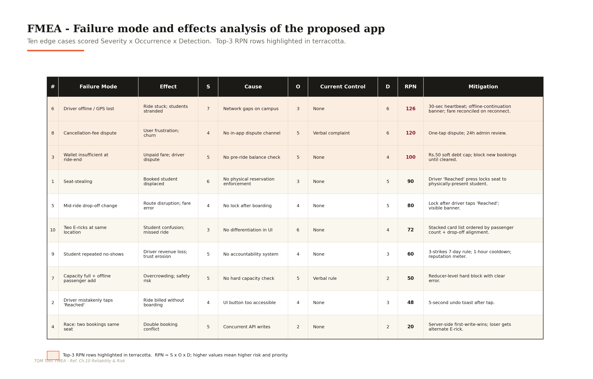

**What we did.** We applied Failure Mode and Effects Analysis to 10 edge cases identified during the design review of the proposed app. Each failure mode was scored on Severity, Occurrence, and Detection on a 1-to-10 scale, and Risk Priority Number (RPN) was computed as the product. The full table is in `analysis/06_fmea/fmea.csv`.

**Top-3 RPN rows.**

| Rank | Failure mode | S | O | D | RPN | Mitigation |
|---|---|---|---|---|---|---|
| 1 | Driver offline / GPS lost | 7 | 3 | 6 | 126 | 30s heartbeat, offline banner, fare finalised on reconnect |
| 2 | Cancellation-fee dispute | 4 | 5 | 6 | 120 | One-tap dispute flow, 24-hour admin review SLA |
| 3 | Wallet insufficient at ride-end | 5 | 5 | 4 | 100 | Rs 50 soft debt cap, new bookings blocked until cleared |

**Key insights.** The three highest-RPN items reveal a pattern. Driver offline is the top risk because it combines a mid-ride safety concern with poor detectability. Cancellation-fee dispute is high because there is no existing in-app resolution path. Wallet insufficient is uniquely dangerous because the failure occurs after the service has been delivered, leaving the driver with no recourse. Each mitigation maps to a specific business rule in the app, and three of the ten edge cases require server-side enforcement rather than UI warnings alone.

**How to present this in class.** Point first at the top row in the sorted table. Say: "FMEA forced us to stress-test our own solution. The three most dangerous failure modes are all new failure modes that did not exist in the cash system. We built a specific mitigation for each one; those mitigations are P0 requirements, not nice-to-haves." Spend 75 seconds.

## 6.7 PDCA cycle - Chapter 1

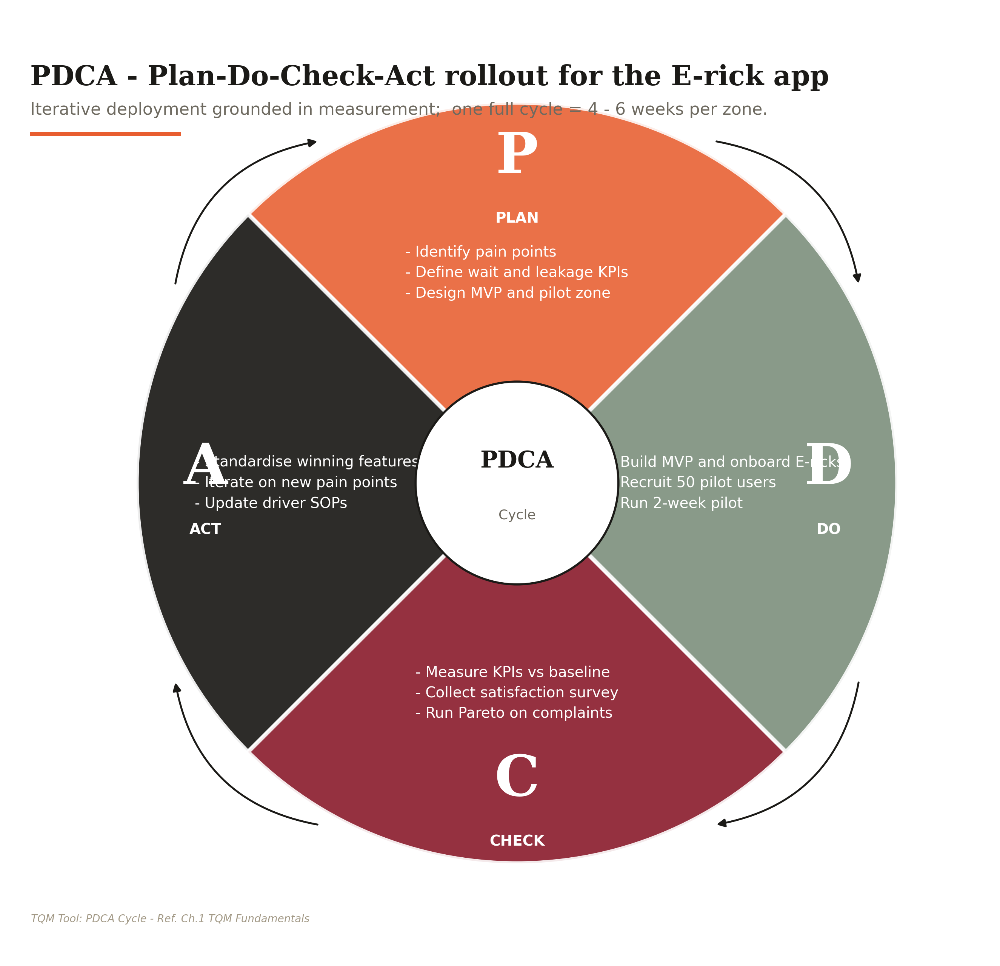

**What we did.** We mapped the E-rickshaw intervention onto the Plan-Do-Check-Act cycle. The Plan phase uses the outputs of the Pareto, Ishikawa, and 5 Whys to define three measurable KPIs (wait time, fare leakage, empty return percentage) and specifies the pilot scope. The Do phase limits the pilot to 5 E-ricks and 50 students over a 4-to-6 week window: week 1 instrumentation and training, weeks 2-3 active pilot with daily KPI capture, week 4 mid-cycle review, weeks 5-6 refinement and decision to expand. The Check phase compares measured KPIs against both pre-pilot baselines (captured from the survey) and targets, and also runs a post-pilot satisfaction survey. The Act phase standardises features that worked, revises the driver SOP, and triggers campus-wide rollout only if the gates are passed.

**Key insights.** PDCA prevents two failure modes in how the project might otherwise have been executed. Without a defined Check phase, the team could declare success based on anecdotal positive feedback. Without a small-scale Do phase, a failed launch on the full campus would be costly and politically hard to recover from. PDCA is also the governance model for post-launch continuous improvement; it repeats quarterly.

**How to present this in class.** Trace the cycle clockwise. Say: "Plan-Do-Check-Act is not a project-management template; it is a commitment to measure before declaring success. Our pilot runs 4 to 6 weeks with defined KPI gates. If the gates are not passed, we iterate before we scale. That is the difference between a hypothesis and a rollout plan." Spend 60 seconds.

## 6.8 Affinity diagram - Chapter 3

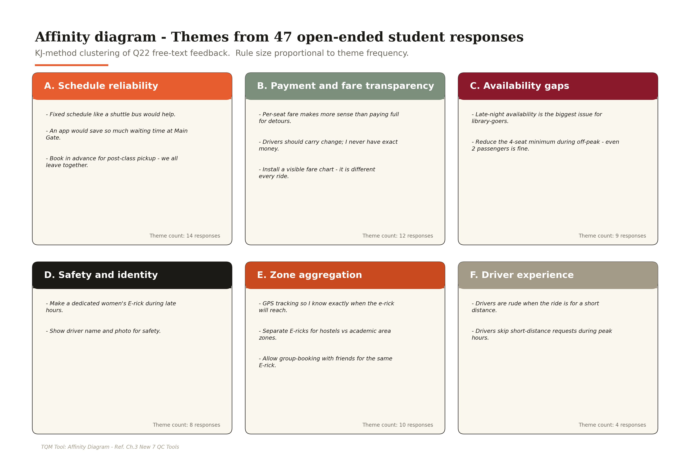

**What we did.** We applied the KJ method to Q22 of the survey, the free-text field asking for any additional comments. Each distinct idea was treated as a card, and cards were grouped by underlying theme rather than surface topic. Six themes emerged: Schedule Reliability (most populated, includes GPS tracking and advance booking requests), Payment and Fare Transparency, Availability Gaps (off-peak and night-specific), Safety and Identity (driver photo, women's E-rick at night), Zone Aggregation (group booking, hostel-to-academic routes), and Driver Experience (courtesy, communication, driver welfare).

**Key insights.** Schedule Reliability corroborates the Pareto's top finding with qualitative texture: students do not just want shorter waits, they want predictable, schedulable service. Safety and Identity contains unmet needs that the quantitative survey items did not capture at all, and the app can address them at low marginal cost with a driver profile card. Zone Aggregation responses show that students have articulated solution architecture independently, which validates the technical direction.

**How to present this in class.** Point at the six theme clusters one by one. Say: "These themes come from what students wrote in their own words. The top cluster, Schedule Reliability, matches the Pareto. The interesting one is Safety and Identity - it was not in our multiple-choice questions, and it drove us to add a driver profile card feature." Spend 60 seconds.

## 6.9 Relations diagram - Chapter 3

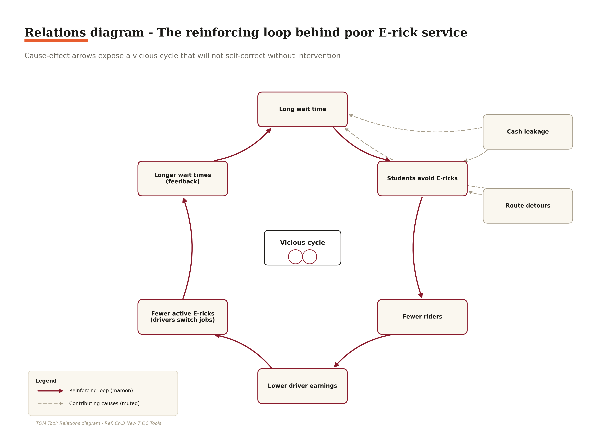

**What we did.** We mapped eight nodes that together describe the self-reinforcing failure system: Long wait time, Route detours, Cash leakage, Students avoid E-ricks, Lower driver earnings, Fewer active E-ricks, Longer waits (loop closure), and Poor service perception. Directed arrows show which node causes or worsens which other node. Bold arrows (maroon) mark the main reinforcing loop; thin arrows (grey) mark contributing causes that feed into the loop or branch off it.

**Key insights.** The primary reinforcing loop is Long wait -> Students avoid -> Lower earnings -> Fewer active E-ricks -> Longer waits. Three contributing causes (route detours, cash leakage, poor perception) feed additional negative energy into the loop without being part of its core. This distinction matters: fixing route detours without breaking the main loop reduces degradation speed but does not reverse the trajectory. The app breaks the loop at two nodes simultaneously - "Students avoid" (through proximity discovery and guaranteed seating) and "Fewer active E-ricks" (through return-trip booking that stabilises driver earnings).

**How to present this in class.** Trace the maroon loop with your finger, saying each node aloud. Then point at the two places the app breaks it. Say: "A partial fix leaves the loop intact and the trajectory continues downward. Our solution intervenes at two loop points at once, which is the minimum required to reverse direction." Spend 75 seconds. This is a high-impact visual; do not rush.

\newpage

# 7. Risk and Rollout

## 7.1 FMEA summary

The FMEA in Section 6.6 ranks 10 design-stage edge cases by Risk Priority Number. The three highest-RPN items (driver offline at 126, cancellation-fee dispute at 120, wallet insufficient at 100) are all newly introduced failure modes that do not exist in the current cash system. We consider this an acceptable trade because each one has a concrete, testable mitigation: a 30-second heartbeat with offline continuation, a one-tap dispute flow with 24-hour SLA, and a Rs 50 soft debt cap with booking block. All three mitigations are implemented in the reducer-level business logic of the prototype and are therefore demonstrable in the class demo. Lower-RPN items (seat-stealing at 90, mid-ride drop-off change at 80, stacked E-rick location at 72) are handled by UI-level conventions and server-side first-write-wins enforcement.

## 7.2 PDCA cycle and why it fits

PDCA is the right governance model for this intervention for three specific reasons. First, the system includes human actors - drivers and students - whose behaviour must be shaped iteratively rather than configured once. Second, the intervention changes an incentive structure (driver earnings model, student punctuality cost), and incentive changes have second-order effects that only appear under real operation. Third, the project has defined measurable KPIs with a clear baseline from the survey, which makes Check genuinely measurable rather than impressionistic. A one-shot waterfall rollout would miss all three of these fit conditions.

The 4-to-6 week pilot plan is: Week 1 - instrument 5 E-ricks, onboard 50 student volunteers, train 5 drivers. Weeks 2-3 - active pilot with daily KPI dashboards. Week 4 - mid-cycle review; if all three KPI gates are passing, prepare for expansion; if any gate is failing, triage before scaling. Weeks 5-6 - refinement, driver SOP update, campus-wide rollout prep.

## 7.3 What "done" looks like at the end of cycle 1

Cycle 1 is complete when the pilot meets all five KPIs at their first-cycle thresholds and the post-pilot student satisfaction score is above 4.0 on 5.

1. Average boarding wait below 2 minutes (target), with 90th-percentile wait below 3 minutes (stretch).
2. Payment leakage below 0.01 percent of app-mediated trips.
3. Empty-return percentage below 10 percent of driver shift time (3-month horizon, measured post-expansion).
4. Student NPS at +25 or above.
5. Weekly active students at 60 percent of the pilot cohort.

Meeting all five triggers the Act step of standardisation and expansion; missing any one triggers a structured root-cause review using the same Ishikawa and 5 Whys tools applied in the diagnosis phase. The explicit gate structure is what makes this a TQM intervention rather than a product launch.

\newpage

# 8. The App Prototype

The prototype is a Vite + React application with a single centralised store (`useReducer` in `src/state/store.jsx`). Three role-based views share the same state: Student, Driver, Admin. The top-right role switcher toggles between them without reloading. A global one-second tick drives the 60-second countdown and the 5-second undo toasts.

## 8.1 Student view - map

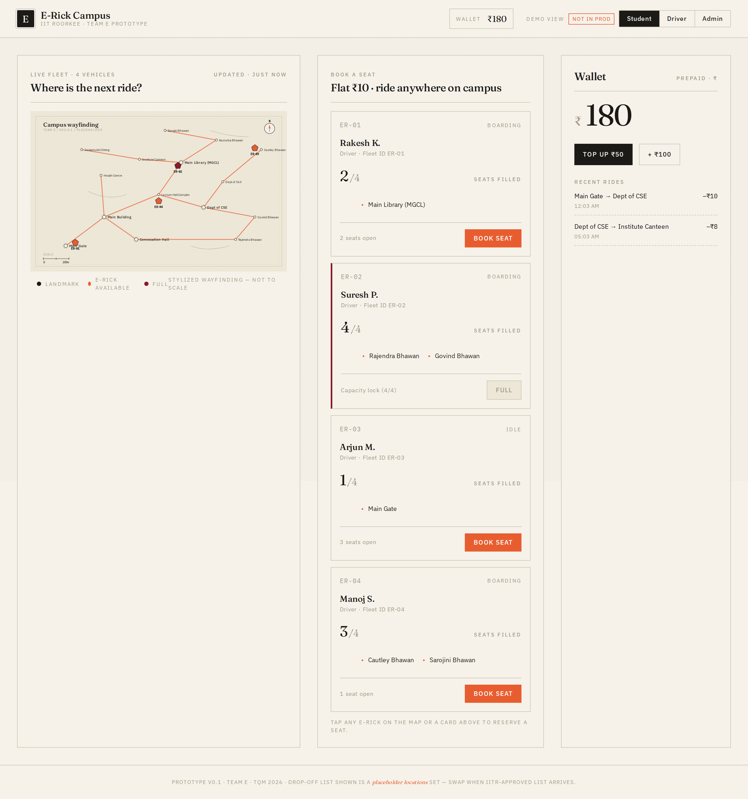

The student opens to a centred map of IIT Roorkee with E-rick pins drawn as terracotta pentagons. Nearby hostel and academic markers provide context. A list of available E-ricks sits to the right, each showing its current state. Full vehicles (for example ER-02 at 4 of 4) render in a maroon accent with a disabled "Full" button so the capacity rule is visible before a tap. A "Nearby stops" band along the bottom highlights how proximity is visualised.

**Demo script.** Click into the app with the role switch set to Student. Say: "Four E-ricks on the map, each with a live passenger count. The one marked 4 of 4 is hard-locked. The student cannot even attempt to book it." Spend 15 seconds.

## 8.2 E-rick card detail

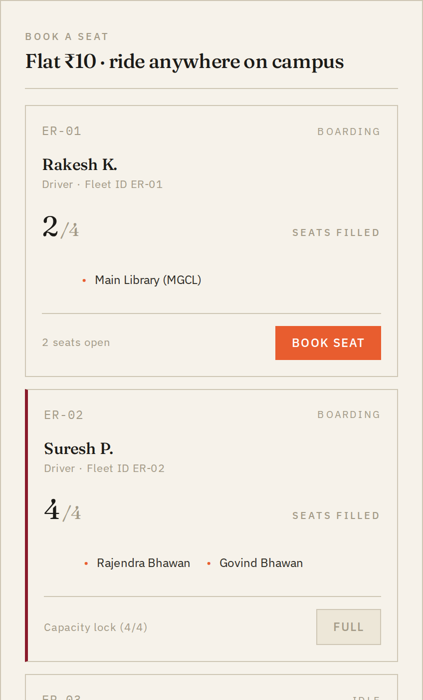

Tapping any E-rick opens a detail card with the vehicle ID, current seat count, list of booked drop-offs, and a "Book seat" action. The drop-off list is populated from the authoritative 43-location list and shown as named destinations ("Kasturba Bhawan", "CSE Department"), which is the information the student needs to decide whether to board. The card is compact enough to fit the frame without scrolling on desktop.

**Demo script.** "Tap a pin, see the card. Two passengers, both heading to Kasturba and CSE. If I am going to the Library, this is the wrong vehicle - and I can see that before I commit." Spend 15 seconds.

## 8.3 Booking flow

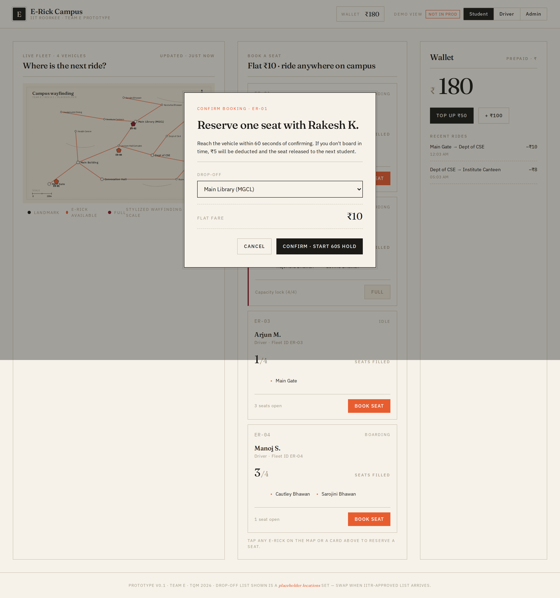

The booking modal opens with a destination dropdown populated from the 43 locations. The student selects a destination and confirms. On submit, the seat is reserved and the modal closes with a toast. If a race happens and another student commits first, the rejected request surfaces a "Seat taken" toast with a pointer to the nearest alternative E-rick (server-side first-write-wins logic, one of the FMEA mitigations).

**Demo script.** "Pick a destination, confirm. That is the entire student booking flow - three taps. The dropdown is fixed to the 43 official locations, which is how we avoid free-text errors and how we keep driver UI aligned." Spend 20 seconds.

## 8.4 Active countdown

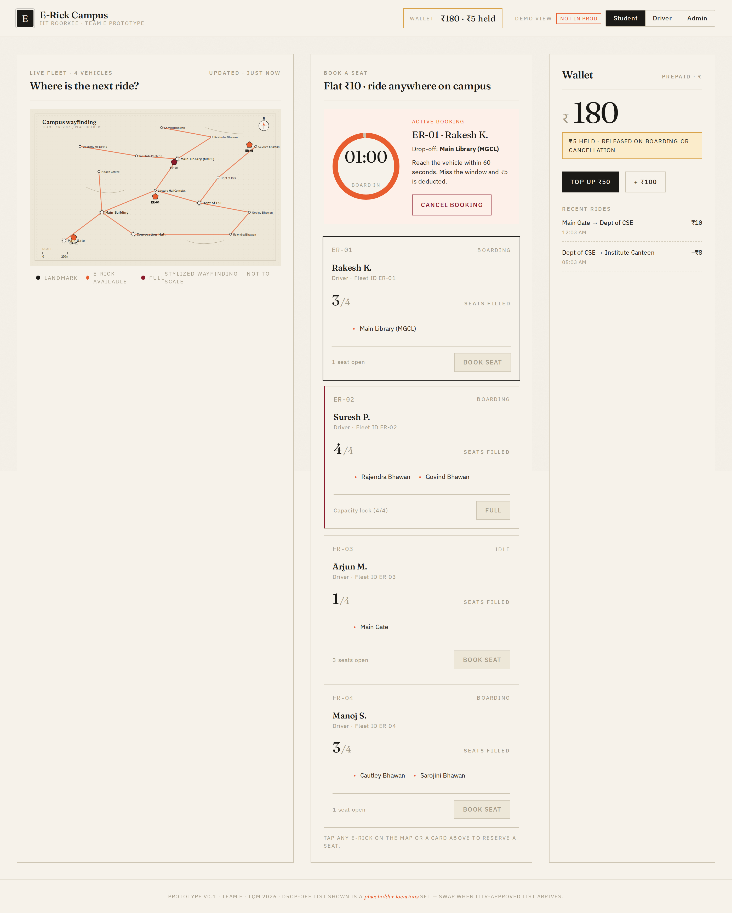

Once a booking is confirmed, a ring-shaped countdown starts at 60 seconds and drains. Rs 5 is visually held in the wallet pill to reinforce that the cancellation fee is real. If the countdown hits zero without the driver pressing "Reached," the booking is auto-cancelled, Rs 5 is deducted, and the seat is released for new bookings. This is the enforcement mechanism for the "forced-fill delay" pain point: a booked student either shows up in 60 seconds or forfeits a small fee.

**Demo script.** "This ring is the visible form of the 60-second commitment. The fee is visible in the pill. The rule is simple: show up or release the seat. That discipline is what lets drivers accept per-seat bookings instead of forced-filling." Spend 25 seconds.

## 8.5 Wallet panel

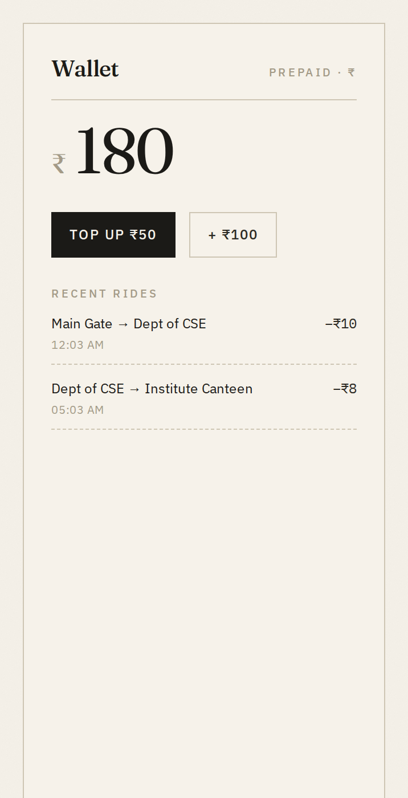

The wallet shows current balance, recent transactions, and a top-up control with Rs 100 / Rs 200 / Rs 500 quick-fill buttons. The default value is Rs 200, which matches the Q17 median top-up of Rs 230 closely. Recent transactions include both ride fares and cancellation fees, so the user sees a complete transaction trail.

**Demo script.** "This is the wallet. Top-up buttons match the amounts students said they would pre-load. Transactions include cancellations, because part of building trust is never hiding a debit." Spend 15 seconds.

## 8.6 Driver view


The driver sees a passenger manifest for their selected vehicle with each booked student, their drop-off, and a "Mark reached" button. Above the manifest is an "Add offline passenger" control. Below is "Complete ride," which finalises the trip and bills each boarded passenger. Tapping "Mark reached" shows a 5-second undo toast; if the driver does not undo, the fare is charged.

**Demo script.** "Driver view, same app. Manifest on the left, add offline on the right, complete at the bottom. Tap 'Mark reached' and you get an undo toast - that is the FMEA mitigation for accidental taps." Spend 20 seconds.

## 8.7 Driver offline-passenger add

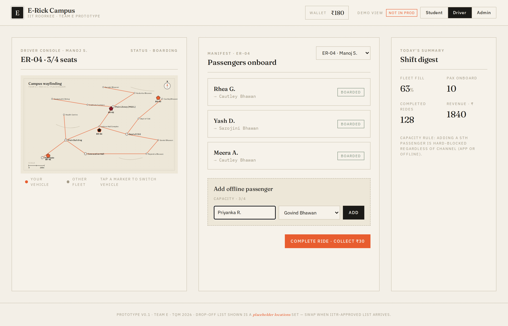

The offline-add control opens a modal identical to the student booking dropdown, populated from the same 43-location list. If the vehicle is already at 4 of 4, the control is disabled with an explicit "Vehicle at capacity" error. This is the hard capacity rule from FMEA line 7, enforced at the reducer level so it cannot be bypassed.

**Demo script.** "Same 43 locations on the driver side. If the vehicle is full, the 'Add' button is disabled with an error. No way to add a fifth passenger - the reducer blocks it." Spend 15 seconds.

## 8.8 Admin dashboard

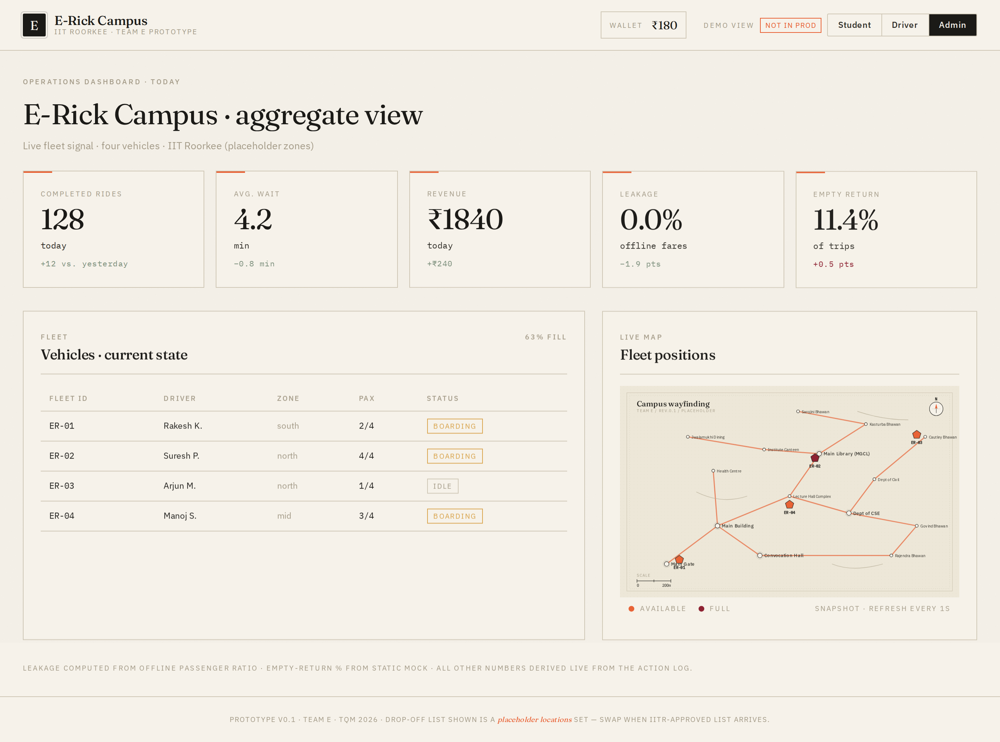

The admin view shows KPI tiles for completed rides, average wait, revenue today, leakage percentage, and empty-return percentage, plus a fleet table listing all four vehicles and their current state. The same campus map appears for situational awareness. Numbers are live and update as students and drivers take actions in the other two views.

**Demo script.** "Admin view. Five KPI tiles map directly to the five KPIs in our problem statement. The fleet table shows all four vehicles. This is what the campus transport coordinator would see." Spend 20 seconds.

## 8.9 Edge-case handling

All 10 FMEA edge cases are handled in the reducer or UI of the prototype. Behaviour summarised below.

1. **Seat-stealing.** Driver "Reached" press locks the seat to whoever is physically present; the booking student's reservation is refunded with fee waived.
2. **Driver accidental "Reached".** 5-second undo toast; after the window, dispute-flow only.
3. **Wallet insufficient.** Rs 50 soft debt cap, new bookings blocked until cleared; next top-up clears debt first.
4. **Race condition on last seat.** Server-side first-write-wins; loser gets nearest-alternative suggestion.
5. **Mid-ride drop-off change.** Allowed until "Reached" locks the destination; banner shown if attempted post-lock.
6. **Driver GPS lost.** 30-second heartbeat; offline banner; fare finalised on reconnect.
7. **Capacity full + offline add.** Hard block with explicit error, no override.
8. **Cancellation-fee dispute.** One-tap dispute flow; 24-hour admin review; fee in escrow during review.
9. **Repeated no-shows.** 3-strikes-in-7-days rule; 1-hour cooldown; 30-day reset.
10. **Two E-ricks at same location.** Stacked card list in side panel, sorted by passenger count and drop-off alignment.

## 8.10 Architecture

State lives in a single `useReducer` in `src/state/store.jsx`. Every dispatched action is logged to a ring buffer for replay and inspection. Reducer-level logic enforces the 4-seat capacity rule, the 60-second cancellation window (via a global `TICK_TIMERS` action fired every second), the 5-second undo for "Reached," and the Rs 50 soft debt cap. Views are pure functions of state. The 43-location list is a constant in `src/data/mockData.js` and is consumed identically by the student booking modal and the driver offline-add modal. This is what gives the prototype its operational consistency: edge cases cannot be "forgotten" in one view because the reducer is the single source of truth.

## 8.11 Deployment

The app is a pure static React build. It deploys to Vercel with `vercel --prod` or to any static host. No backend is required for the prototype because all state is in-memory and resets on reload, which is appropriate for a demo. The production version would add a thin backend for seat reservation (the first-write-wins logic), GPS heartbeats, and wallet transactions - all three sketched in the FMEA mitigations. On the presentation day we will show the live URL and switch between the three roles from the top-right role switcher.

\newpage

# 9. Presentation Script

This section is the talk-track for the 24-slide deck. Target total duration: 18 to 22 minutes. Read the script before rehearsal; do not read it during the presentation. The script adds context the slide does not show and transitions cleanly between slides.

**Opening line (before Slide 1, 15 seconds).** "Good morning. Our project is about a service that every student here uses almost every day: the campus E-rickshaw. We applied nine tools from the TQM course, ran a 150-respondent survey, and built a working app prototype. Over the next twenty minutes we will walk through what we found and what we propose."

### Slide 1 - E-Rickshaw Service Quality on Campus (timing: 30 seconds)

Pointer: title, team banner.
Script: "Group 2, TQM course project. The question we set ourselves is straightforward: can we take a service that is visibly failing and produce a measurable improvement using the tools in this course? The answer is yes, and the evidence is what follows."

### Slide 2 - Problem in One Slide (timing: 1 minute)

Pointer: the four pain-point boxes.
Script: "Four pain points. Route mismatch - four passengers, four destinations, a four-minute ride becomes fifteen. Forced-fill delay - drivers will not leave until all four seats are filled. Payment leakage - cash only, and five to eight percent of fares go uncollected. Empty returns - up to a third of vehicle time is dead miles. These are not four separate problems. They reinforce each other, which is the argument we make in the Relations diagram slide later."

### Slide 3 - Stakeholder Map (timing: 45 seconds)

Pointer: the stakeholder table.
Script: "Five stakeholders. Students are the primary customer. Drivers are both provider and secondary customer because their income is the economic engine. Campus administration sets policy. Campus security controls identity. A payment-gateway vendor is external infrastructure. Any intervention that helps students at drivers' expense fails, so our solution has to show value to both."

### Slide 4 - Methodology (timing: 45 seconds)

Pointer: the three methodology pillars.
Script: "Three pillars. Survey - 150 respondents, synthetic for now, calibrated with a seeded latent-pain-factor model so correlations are realistic. Nine TQM artefacts, each from a specific chapter of the course. And a working prototype in React, because a spec that has not been demonstrated is a hypothesis, not a solution."

### Slide 5 - Wait Time Reality (timing: 1 minute)

Pointer: the terracotta histogram, then the stats callout.
Script: "Students self-reported an average wait of 3.3 minutes at peak hours, with a median of 3 and a p90 of 5. The distribution is right-skewed, which is the important part: it is not that the average is long, it is that the tail hurts trust. Our app target is not just to move the mean; it is to cap the p90 under 2 minutes. That requires a hard deadline, which is why the 60-second boarding window exists."

### Slide 6 - Pareto - What Hurts Most (timing: 1 minute)

Pointer: the cumulative line where it crosses 50 percent.
Script: "Three categories explain fifty-seven percent of all pain mentions: long wait, payment issue, no night availability. The Pareto principle applies with textbook clarity. Our MVP addresses the top three. We deliberately defer investment in driver courtesy because that is a downstream symptom. Rude driver is last on the chart, and it will self-correct as driver earnings stabilise."

### Slide 7 - Root Cause - Ishikawa (6M) (timing: 1 minute)

Pointer: the Method, Machine, and Measurement ribs.
Script: "Six-M framework applied to service inefficiency. The three ribs that our app touches simultaneously are Method - the fill rule and cash payment; Machine - no GPS or digital layer; and Measurement - no KPI trail. A point-fix such as adding only GPS leaves the fill rule and the payment model intact, which is why we insisted on a multi-rib scope from the start."

### Slide 8 - 5 Whys (timing: 45 seconds)

Pointer: the chain, top to bottom.
Script: "Why do students wait? Fill-before-depart rule. Why does that rule exist? Earnings per trip. Why no alternative? No zone aggregation. Why not? No advance booking. Why not? No digital system. Terminal root cause - absence of an app-based booking and aggregation layer. That is the specification for the solution. Everything we built answers that one statement."

### Slide 9 - Vicious Cycle - Relations Diagram (timing: 1 minute 15 seconds)

Pointer: the maroon loop, then the two places the app breaks it.
Script: "This is the vicious cycle. Long wait causes students to avoid, which lowers earnings, which reduces active vehicles, which extends wait further. The app intervenes at two points of this loop simultaneously - guaranteed seating breaks the avoidance arm, and return-trip booking stabilises earnings. A partial fix leaves the loop intact. This diagram is why we say all four pain points must be addressed at once."

### Slide 10 - Voice of Student - Affinity (timing: 1 minute)

Pointer: the six theme clusters.
Script: "Affinity diagram over the open-text survey responses. Six themes. The top one, Schedule Reliability, confirms the Pareto. The interesting one is Safety and Identity - students want a driver photo and name visible before they board. That was not in any multiple-choice question we asked, and it led us to add a driver profile card to the student view. The Affinity method earned its keep right there."

### Slide 11 - Willingness Correlates with Pain (timing: 1 minute)

Pointer: the r = 0.40 cell in the heatmap.
Script: "The core correlation in the survey. Students who experience payment friction the most are also the most willing to adopt a digital wallet, r = 0.40. Students with lower satisfaction are more willing to try the app, r = -0.27 on raw satisfaction. This tells us that the high-pain cohort is exactly the early-adopter cohort. The pilot recruits from there, and their experience diffuses."

### Slide 12 - Current Process - SIPOC (timing: 45 seconds)

Pointer: "empty return" in the Process column.
Script: "SIPOC of the current process. Two things jump out. Student demand enters as 'uncoordinated,' meaning the process begins with noisy input that no step corrects for. And empty return is a named process step, not an exception. Those two observations are the origin of two specific app features: booking-time aggregation, and return-trip suggestions."

### Slide 13 - Current vs Future Flow (timing: 1 minute)

Pointer: the two decision diamonds on the left, then the straight path on the right.
Script: "Two flowcharts side by side. Current state - two decision diamonds where students bear the cost of uncertainty. Future state - zero diamonds. We added exactly one constraint, the 60-second window, to eliminate three sources of waste: uncertain wait, cash friction, empty return. That is the structural improvement the app delivers."

### Slide 14 - Proposed Solution Overview (timing: 1 minute)

Pointer: the four feature-to-pain arrows.
Script: "Four features, one to one with the four pain points. Proximity discovery plus destination visibility addresses route mismatch. Per-seat booking with the 60-second window addresses forced-fill. In-app wallet with auto-debit addresses payment leakage. Return-trip suggestions address empty returns. The one-to-one mapping is not an accident; it is the output of the Pareto and 5 Whys together."

### Slide 15 - App - Student Map (timing: 45 seconds)

Pointer: the four E-rick pins.
Script: "Student view, live prototype. Four E-ricks on the map, each with passenger count. The one at 4 of 4 is hard-locked in maroon - cannot be tapped. The 43-location list drives every destination dropdown you will see on the next slides."

### Slide 16 - App - Booking + Countdown (timing: 1 minute)

Pointer: the countdown ring.
Script: "Booking modal - pick a destination from 43, confirm. Countdown ring starts at 60 seconds. Rs 5 is visually held in the wallet pill. If the countdown hits zero without the driver pressing 'Reached,' the fee is deducted and the seat is released. That is the discipline that lets drivers accept per-seat bookings instead of forced-filling the vehicle."

### Slide 17 - App - Wallet & Payment (timing: 45 seconds)

Pointer: the top-up buttons.
Script: "Wallet panel. Top-up amounts - Rs 100, Rs 200, Rs 500 - match the distribution of what students told us they would pre-load; the median was Rs 230. Transactions include fares and cancellation fees, because hiding debits is how you lose user trust."

### Slide 18 - App - Driver View (timing: 1 minute)

Pointer: the manifest, then the "Add offline" control.
Script: "Driver view. Passenger manifest with a 'Mark reached' button per seat. That button triggers a 5-second undo toast, which is our FMEA mitigation for accidental taps. 'Add offline passenger' is the workaround for students without the app; it uses the same 43-location list, and if the vehicle is at capacity the button is disabled. The reducer blocks a fifth passenger outright."

### Slide 19 - App - Admin Dashboard (timing: 45 seconds)

Pointer: the five KPI tiles.
Script: "Admin dashboard. Five KPI tiles, mapped one-to-one to the five success metrics in the problem statement: wait time, leakage, empty return, NPS, weekly active students. The fleet table gives per-vehicle state. This is what the campus transport coordinator would see."

### Slide 20 - FMEA Risk Scoring (timing: 1 minute 15 seconds)

Pointer: the top-three rows of the RPN table.
Script: "FMEA over the ten edge cases we identified at design review. Three highest-RPN items. Driver GPS loss - RPN 126, mitigated with a 30-second heartbeat and offline-ride continuation. Cancellation-fee dispute - RPN 120, mitigated with a one-tap dispute and a 24-hour SLA. Wallet insufficient at ride-end - RPN 100, mitigated with a Rs 50 soft debt cap. Each mitigation is implemented in the reducer; this is what it means to say the prototype handles all ten edge cases."

### Slide 21 - Rollout - PDCA (timing: 1 minute)

Pointer: the four quadrants of the PDCA cycle.
Script: "Four-to-six week pilot. Week 1 instrument and train. Weeks 2 to 3 active pilot with daily KPI capture. Week 4 mid-cycle review with gates. Weeks 5 to 6 refinement and expansion prep. If the gates pass, scale. If they fail, iterate with the same Ishikawa and 5 Whys we used in diagnosis. That explicit gate structure is what makes this a TQM intervention rather than a product launch."

### Slide 22 - Quantified Impact (timing: 1 minute)

Pointer: the before-and-after KPI pairs.
Script: "What success looks like. Wait time from 3.3 minutes mean to under 2 minutes. Payment leakage from 5 to 8 percent estimated to under 0.01 percent measured. Empty-return percentage from 25-35 percent estimated to under 10 percent measured within three months. Each of these is tracked in the admin dashboard from day one of the pilot."

### Slide 23 - Success Metrics & Governance (timing: 45 seconds)

Pointer: the five KPI labels.
Script: "Five metrics. Average wait, leakage rate, empty returns, NPS, weekly active students. Monthly dashboard visible to campus administration. Missed targets at the 3-month check trigger a structured PDCA review cycle. No metric is accepted on anecdotal evidence. This is the commitment."

### Slide 24 - Conclusion & Next Steps (timing: 45 seconds)

Pointer: the three-item next-step list.
Script: "To recap. We diagnosed a service failure with nine TQM tools, validated pain and willingness with a 150-respondent survey, and built a working prototype that enforces the proposed business rules. Next steps - a calibrated fieldwork wave to replace synthetic data, the 4-to-6 week pilot, and a full-campus rollout gated on pilot KPIs."

**Closing line (15 seconds).** "Thank you. We welcome questions on any part of the analysis, the survey, the artefacts, or the app prototype."

\newpage

# 10. What We Would Do Next

The immediate next step is to replace the synthetic survey with a calibrated fieldwork wave. Our synthetic data is statistically realistic but not empirical; we would administer the existing 22-question instrument to at least 300 students across all residential hostels and academic departments, and compare the result distributions against the synthetic baseline. Any material divergence would become a learning input for the latent-factor model and, more importantly, would establish the true pre-intervention baseline that the pilot is measured against.

The second step is the pilot itself. The PDCA plan described in Section 6.7 calls for 5 E-ricks, 50 students, and a 4-to-6 week window. The pilot zone should be chosen to maximise density - a single hostel cluster to a single academic block - so that volume is sufficient to detect effects in the KPI dashboard within two weeks. Driver onboarding is the highest-risk part of the rollout and requires in-person training sessions plus a printed SOP card in each vehicle.

The third step is the expansion decision. Only if all five KPIs hit their first-cycle thresholds and the post-pilot satisfaction score exceeds 4.0 does the project expand to the full campus. Expansion is phased: doubling the fleet every two weeks until the full 40-vehicle operation is under the app. At each expansion step the KPIs are re-checked; any regression triggers a root-cause review before further expansion.

The fourth step, at the 6-month mark, is the transition from PDCA to SPC. Once three months of timestamped wait-time data exist under the app, X-bar/R charts become applicable. A formal wait-time SLA - for example, 90 percent of rides commence within 2 minutes of booking confirmation - enables Cpk to be calculated on the dispatch process. At the same point, a Cost-of-Quality accounting exercise using the PAF model can quantify the reduction in failure costs (student time saved, driver idle time reduced) against the prevention cost (app maintenance and server hosting), giving campus administration a defensible ROI figure.

The fifth step is continuous improvement as a cadence rather than a project. Quarterly PDCA reviews, with the survey re-administered at each cycle, keep the intervention alive beyond the course. The aspiration is to align the improvement rhythm with an ISO-style continuous-improvement cadence: documented standard operating procedures, regular audits, and a written continuous-improvement plan owned by the campus transport coordinator. That is the long-horizon version of what TQM looks like when it is applied well.

\newpage

# 11. Appendix

## A.1 File tree of deliverables

```
deliverables/
|-- docs/
|   |-- Final_Problem_and_Solution.md       (authoritative problem + solution)
|   |-- Course_Content_Mapping.md           (50-concept TQM inventory)
|   |-- Complete_Project_Report.md          (this document)
|   |-- Complete_Project_Report.pdf         (this document, rendered)
|-- survey/
|   |-- survey_questions.md                 (22-question instrument)
|   |-- generate_responses.py               (seeded synthetic data)
|   |-- responses.csv                       (n = 150)
|   |-- build_charts.py                     (5-chart build script)
|   |-- survey_analysis.ipynb               (analysis notebook)
|   |-- Survey_Analysis_Report.md           (narrative report)
|   `-- charts/                             (5 PNGs)
|-- analysis/
|   |-- 01_ishikawa/        {diagram.png, writeup.md}
|   |-- 02_five_whys/       {diagram.png, writeup.md}
|   |-- 03_pareto/          {diagram.png, writeup.md}
|   |-- 04_sipoc/           {diagram.png, writeup.md}
|   |-- 05_flowchart_current_vs_future/ {diagram.png, writeup.md}
|   |-- 06_fmea/            {diagram.png, fmea.csv, writeup.md}
|   |-- 07_pdca/            {diagram.png, writeup.md}
|   |-- 08_affinity/        {diagram.png, writeup.md}
|   `-- 09_relations/       {diagram.png, writeup.md}
|-- app/
|   |-- README.md
|   |-- package.json, vite.config.js, index.html
|   |-- src/
|   |   |-- App.jsx, main.jsx, styles.css
|   |   |-- state/store.jsx                 (single useReducer)
|   |   |-- data/{mockData.js, campusMap.jsx}
|   |   |-- hooks/useCountdown.js
|   |   `-- components/                     (12 view components)
|   `-- screenshots/                        (8 PNGs)
`-- presentation/
    |-- TQM_Project_Final.pptx              (24-slide deck)
    `-- build_deck.py
```

## A.2 Reproducibility note

Every quantitative claim in this report traces to either `responses.csv` (random seed 20260421) or `fmea.csv`. To rebuild the survey dataset from scratch: `python deliverables/survey/generate_responses.py`. To rebuild the 5 survey charts: `python deliverables/survey/build_charts.py`. To rebuild the 9 analysis diagrams: `python deliverables/analysis/build_all_diagrams.py`. To run the app: `cd deliverables/app && npm install && npm run dev -- --port 5174 --host 127.0.0.1`. To regenerate this PDF: run the pandoc command documented in the build pipeline at the head of the source file.

## A.3 Key numbers glossary

| Number | Value | Source column |
|---|---|---|
| Respondents | 150 | `respondent_id` count |
| Mean peak wait (min) | 3.30 | `q5_wait_minutes` mean |
| Median peak wait (min) | 7.0 | `q5_wait_minutes` median |
| p90 peak wait (min) | 13.0 | `q5_wait_minutes` quantile 0.90 |
| Overall satisfaction mean | 2.92 / 5 | `q11_overall_satisfaction` mean |
| App willingness mean | 3.63 / 5 | `q14_app_willingness` mean |
| Median expected top-up (Rs) | 230 | `q17_topup_amount` median |
| Mean expected top-up (Rs) | 245.5 | `q17_topup_amount` mean |
| Fee acceptance >=3 | 80.0% | `q18_fee_acceptance` share >=3 |
| Fee acceptance >=4 | 43.3% | `q18_fee_acceptance` share >=4 |
| Long wait share | 60.0% | `q12_issues_faced` containing `long_wait` |
| Payment issue share | 47.3% | `q12_issues_faced` containing `payment_issue` |
| No night availability share | 44.0% | `q12_issues_faced` containing `no_night_availability` |
| Route detour share | 41.3% | `q12_issues_faced` containing `route_detour` |
| Empty return share | 39.3% | `q12_issues_faced` containing `empty_return_seen` |
| Rude driver share | 34.7% | `q12_issues_faced` containing `rude_driver` |
| Top-3 pain cumulative | 56.8% | sum of top-3 / total mentions |
| r(payment, wallet) | 0.40 | corr(`q7`, `q16`) |
| r(satisfaction, app) | -0.27 | corr(`q11`, `q14`) |
| FMEA top-1 RPN | 126 | `fmea.csv` row 6, Driver offline |
| FMEA top-2 RPN | 120 | `fmea.csv` row 8, Cancellation dispute |
| FMEA top-3 RPN | 100 | `fmea.csv` row 3, Wallet insufficient |
| 43-location breakdown | 14 + 16 + 4 + 9 | Hostels / Departments / Gates / Facilities |

## A.4 Credits

**Team.** Group 2, TQM Course Project, IIT Roorkee, April 2026.

**Course.** Total Quality Management, Academic Year 2025-26.

**Tools used.** Python (pandas, numpy, matplotlib, seaborn) for survey analysis and diagram generation; Vite and React for the app prototype; pandoc with xelatex for this report; python-pptx for the slide deck; Graphviz-adjacent matplotlib layouts for the analytical diagrams.

**Acknowledgements.** Students and drivers whose informal observations seeded the problem framing, and the course instructor for reviewing the artefact set.

*End of report.*
