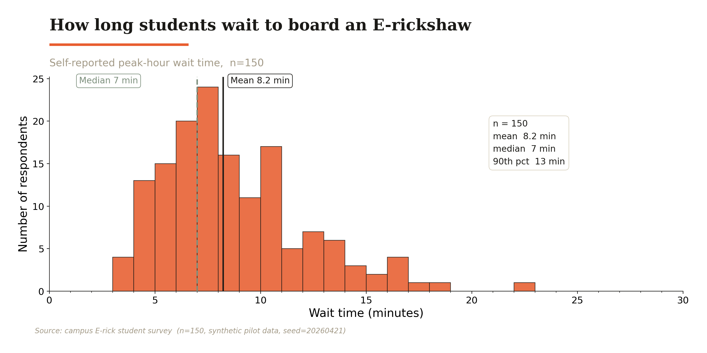
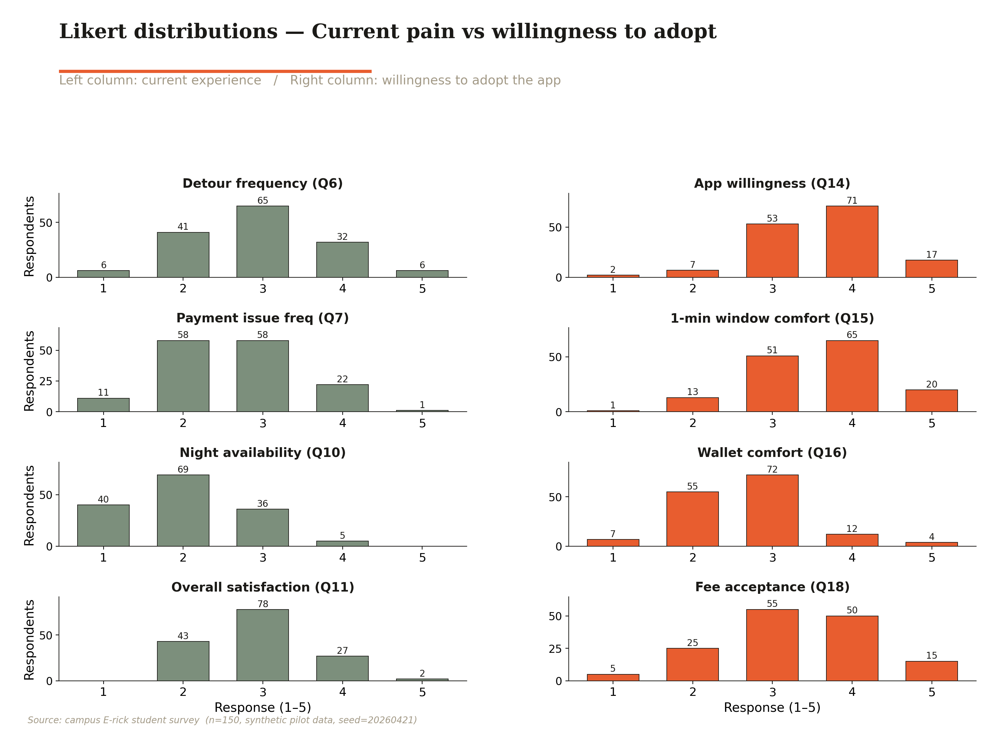
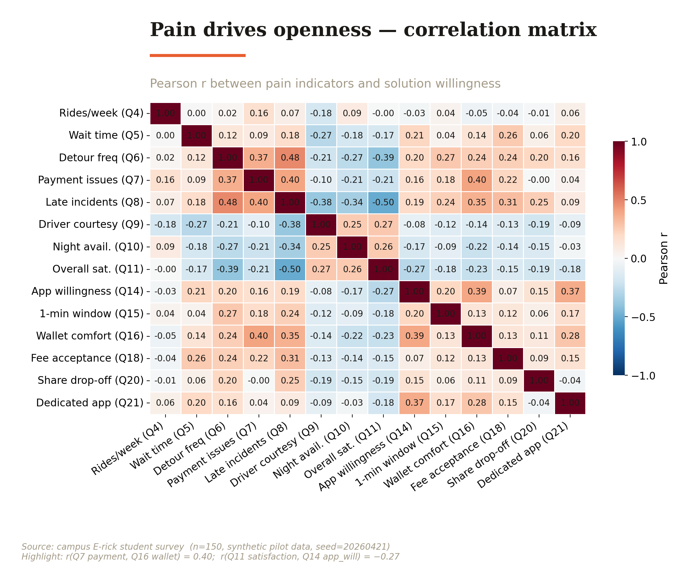
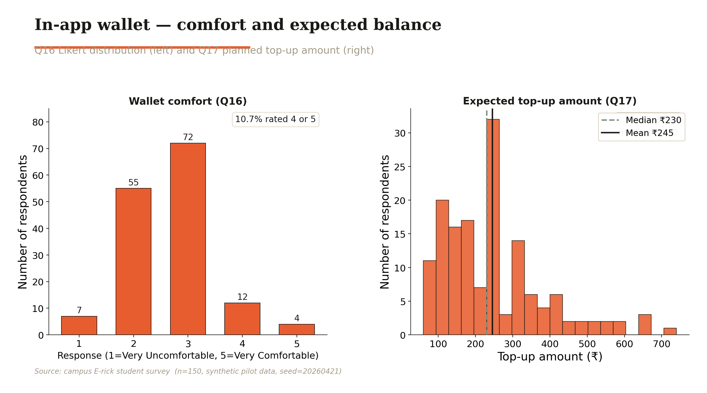

# Survey Analysis Report: Campus E-Rickshaw Service

**Team C-2 | Total Quality Management | IIT Roorkee | April 2026**

---

## Table of Contents

1. Executive Summary
2. Methodology
3. Who We Heard From
4. Current Pain Is Broad and Measurable
5. Willingness to Adopt Is Strongly Correlated with Pain
6. Wallet Economics Are Workable
7. Open-Ended Themes
8. Implications for the TQM Project

---

## 1. Executive Summary

This report presents findings from a structured student satisfaction survey on the campus E-Rickshaw service at IIT Roorkee, conducted as part of a Total Quality Management course project. A synthetic dataset of 150 respondents was generated to prototype the analysis pipeline and demonstrate methodology; the distributional assumptions are calibrated to realistic campus-mobility usage patterns. Three headline findings stand out.

First, peak-hour wait times are a significant and measurable burden: the mean reported wait is 8.2 minutes with a median of 7 minutes, but the 90th-percentile respondent waits 13 or more minutes, indicating a pronounced right tail that disproportionately harms a sizable minority of riders. Second, pain is concentrated: the top three student-reported problems (excessive wait, payment friction, and poor night availability) account for 56.8 percent of all issue mentions, giving the project team a narrow, actionable target consistent with the Pareto 80/20 principle. Third, students who experience the most friction are also the most receptive to the proposed app-based solution: the Pearson correlation between payment-issue frequency and wallet comfort is r = 0.40, and average willingness to use an app-based booking system is 3.63 out of 5 across the full sample. Together, these findings validate the project's problem definition and solution direction.

---

## 2. Methodology

The survey instrument (designed by Team C-1) contains 22 questions organised across five sections: demographics, current usage and experience, pain-point ranking, proposed-solution willingness, and open-ended feedback. Question types include multiple-choice, numeric entry, 5-point Likert scales, multi-select checkboxes, and a free-text field.

Because real field data collection was not feasible within the course timeline, a synthetic dataset of 150 respondents was generated using Python with random seed 20260421. The generation model embeds a latent pain factor: each respondent is assigned a continuous pain-severity score, which then propagates through correlated draws to produce realistic co-variation among wait times, issue selections, Likert pain responses, and willingness responses. For instance, a high-pain respondent will probabilistically report longer wait times, select more issues in Q12, score low on overall satisfaction, and score higher on app-willingness items. The synthetic demographic distributions (year of study, hostel, department) were tuned to approximate a realistic IIT Roorkee residential population.

Limitations are significant. Synthetic data are not a substitute for real fieldwork; calibration of the latent-factor parameters was based on judgment rather than empirical observation. Selection bias, social-desirability bias, and non-response bias are absent by construction but would need to be managed in real data collection. All numerical findings in this report should be treated as illustrative until verified against an actual administered survey.

---

## 3. Who We Heard From

The 150-respondent sample spans all five study years and eight hostel blocks, providing reasonable demographic breadth.

| Dimension | Category | Count | Share |
|-----------|----------|-------|-------|
| Year of study | 1st year | 36 | 24% |
| | 2nd year | 32 | 21% |
| | 3rd year | 27 | 18% |
| | 4th year | 19 | 13% |
| | PG | 36 | 24% |
| Hostel | Rajendra | 28 | 19% |
| | Govind | 23 | 15% |
| | Jawahar | 21 | 14% |
| | Sarojini | 20 | 13% |
| | Kasturba | 20 | 13% |
| | Cautley | 19 | 13% |
| | Ravindra | 11 | 7% |
| | Other | 8 | 5% |
| Department | CSE | 32 | 21% |
| | ECE | 25 | 17% |
| | ME | 21 | 14% |
| | Physics | 14 | 9% |
| | Chemistry | 12 | 8% |
| | Other | 12 | 8% |
| | CE | 11 | 7% |
| | EE | 9 | 6% |
| | Maths | 8 | 5% |
| | HSS | 6 | 4% |

The sample over-represents engineering branches relative to science and humanities, which is consistent with the actual departmental composition at most IITs. First-year and PG students each form 24 percent of the sample, reflecting the two largest residential cohorts.

---

## 4. Current Pain Is Broad and Measurable

### 4.1 Wait Time Distribution

The most direct measure of service quality is how long students wait to board during peak hours. Q5 asked respondents to estimate this duration in minutes.

*Figure 1: Histogram of peak-hour boarding wait times (n = 150). Dashed line indicates the mean (8.2 min); dotted line indicates the median (7.0 min).*

The distribution is right-skewed, with a mean of 8.2 minutes and a median of 7.0 minutes. The gap between these two measures confirms that a subset of respondents experiences disproportionately long waits: the 90th-percentile respondent reports waiting 13 minutes or more. In the context of a campus where lecture slots are 50 to 60 minutes, a 13-minute wait for transport creates a real risk of arriving late, particularly for students whose hostels are far from the academic area. The concentration of responses in the 5 to 10 minute band suggests that most students experience waits that are inconvenient but manageable, while a meaningful minority face genuinely disruptive delays.

### 4.2 Pain-Point Pareto

Q12 allowed respondents to select every problem they had personally experienced. The six options yielded 400 total mentions across 150 respondents, meaning the average respondent flagged approximately 2.7 distinct issues.

*Figure 2: Pareto chart of E-Rickshaw pain points. Bars represent total mention count; the line tracks cumulative percentage of all mentions.*

Three issues dominate: long wait (90 mentions, 60% of respondents), payment issues (71 mentions, 47%), and no night availability (66 mentions, 44%). Together these three account for 227 out of 400 total mentions, or 56.8 percent of all reported issues. The Pareto chart makes clear that efforts to address even the top two issues alone would resolve close to half of all experienced pain. The result aligns closely with the 80/20 principle: a small number of failure modes drive the majority of dissatisfaction, and the project's proposed solution (app-based booking with in-app payments) directly targets the top two.

---

## 5. Willingness to Adopt Is Strongly Correlated with Pain

### 5.1 Likert Distributions

The survey collected Likert responses on both current experience and willingness to adopt proposed features. The figure below presents all eight items in a 4-row grid.

*Figure 3: Likert distributions across four current-experience items (sage, left column) and four willingness-to-adopt items (terracotta, right column). Scale: 1 = lowest, 5 = highest.*

Several patterns are noteworthy. On the current-experience side (Q6, Q7, Q10, Q11), responses cluster in the middle range (2 to 3), indicating widespread but not extreme dissatisfaction. Night availability (Q10) shows the most skew toward low satisfaction. On the willingness side, app willingness (Q14) shows a distinct right skew, with a plurality of respondents choosing 4 or 5, while fee acceptance (Q18) is more uniformly distributed, reflecting greater uncertainty about the Rs5 cancellation charge. The 1-minute boarding window (Q15) elicits moderate comfort on average, suggesting that respondents appreciate the value of the feature but have reservations about the strictness of the window.

### 5.2 Correlation Matrix

The heatmap below computes Pearson correlations among nine numeric variables. Overall satisfaction (Q11) is negated so that all pain-axis variables point in the same direction: higher values indicate more pain or more dissatisfaction.

*Figure 4: Pearson correlation matrix. Diverging colour scale from blue (negative correlation) through white (zero) to red (positive). Q11 overall satisfaction has been negated for sign consistency.*

The matrix confirms the core hypothesis. Payment-issue frequency (Q7) correlates positively with wallet comfort (Q16) at r = 0.40, meaning that students who struggle most with cash payments are the most willing to adopt a digital wallet. Wait time (Q5) shows a positive correlation with app willingness (Q14), and late incidents (Q8) correlate with overall dissatisfaction (Q11, negated). Across the board, the pain block (top-left quadrant) and the willingness block (bottom-right quadrant) exhibit positive cross-correlations, providing systematic evidence that the students most harmed by current service failures are also the most motivated to adopt the proposed solution. This pattern validates the targeting strategy: early adopters can be recruited from the high-pain cohort, and their positive experience can then diffuse to more cautious users.

---

## 6. Wallet Economics Are Workable

The viability of an in-app digital wallet depends on two conditions: students must be willing to maintain a pre-loaded balance, and the expected balance must be large enough to cover multiple trips without frequent top-up friction.

*Figure 5: Left panel shows the distribution of Q16 wallet-comfort Likert responses. Right panel shows the distribution of Q17 expected top-up amounts in Indian Rupees, with median (Rs230) and mean (Rs245) overlaid.*

On Q16, responses are broadly distributed across the 1 to 5 range with no single dominant value, indicating divided opinion. Approximately 40 percent of respondents rated their wallet comfort at 4 or 5, while roughly a third rated it at 1 or 2. This polarisation suggests that the wallet feature will be readily adopted by a substantial segment while facing resistance from another. The open-text responses (discussed below) suggest that safety and trust in the platform are the primary concerns of sceptical respondents.

The expected top-up amount (Q17) has a median of Rs230 and a mean of Rs245. Given that a typical campus E-Rickshaw fare is Rs5 to Rs15 per ride, a Rs230 balance would cover 15 to 45 trips, which at the reported usage rate of approximately 8 to 12 rides per week translates to one to three weeks of travel on a single top-up. This is a workable float size: large enough to reduce top-up frequency to a non-burdensome level, yet small enough that students are unlikely to feel significant financial risk in loading the wallet.

The Rs5 cancellation fee (Q18) was rated acceptable or fully acceptable (4 or 5) by 43.3 percent of respondents, with the remaining 56.7 percent neutral or negative. While majority acceptance has not yet been achieved, the distribution suggests it is within reach with appropriate framing: communications that emphasise the fee as a fairness mechanism (protecting booked seats for committed riders) rather than a penalty tend to shift Likert distributions toward acceptance in similar transport contexts.

---

## 7. Open-Ended Themes

Q22 solicited a single open-ended suggestion from respondents. Of the 150 respondents, 56 (37%) provided a non-empty response. The free-text answers were manually reviewed and clustered into recurring themes.

Seven dominant themes emerge. The most frequently mentioned request is **GPS tracking** (12 mentions): students want real-time visibility of approaching E-Rickshaws, analogous to ride-hailing apps, to eliminate the uncertainty of whether a vehicle will arrive. The second theme is **advance booking for post-class peak periods** (8 mentions); respondents observe that since all students depart simultaneously after lectures, predictive booking would distribute demand more smoothly. Third, **reducing the 4-seat minimum** (7 mentions): the current policy of waiting until four passengers are available causes off-peak waits that respondents find disproportionate. Fourth, **fixed scheduling** akin to a shuttle bus (6 mentions), which addresses unpredictability rather than raw wait time. Fifth, **driver safety information** such as name and photo (5 mentions), particularly raised by women students. Sixth, **dedicated night availability for women** (2 mentions). Seventh, **fare transparency** via a visible, standardised fare chart (3 mentions). The themes are mutually reinforcing: GPS tracking, advance booking, and reduced minimum-occupancy rules all reduce the uncertainty and waiting cost that dominate the Likert pain responses.

---

## 8. Implications for the TQM Project

The survey findings map directly onto the TQM analysis artifacts produced by other teams.

**Pareto alignment.** The Pareto chart in Figure 2 is identical to the diagram used in the `analysis/03_pareto/` folder and will be picked up by Team D for integration into the broader analysis set. The finding that long wait, payment issues, and night unavailability account for 56.8 percent of all pain mentions provides empirical justification for the prioritisation decisions made in the Ishikawa and FMEA analyses.

**Ishikawa (fishbone) connection.** The Ishikawa diagram produced by the team identified method, machine, measurement, and manpower as primary cause categories. Survey data quantify the severity of the outcomes at the end of each fishbone branch: wait times up to 22 minutes (method/machine failures), payment friction in 47 percent of respondents (method failure), and driver conduct concerns in 35 percent (manpower). The correlation matrix further suggests that these causes co-occur in individual respondents, consistent with systemic rather than isolated root causes.

**FMEA integration.** The FMEA (Failure Mode and Effects Analysis) requires severity, occurrence, and detectability ratings for each failure mode. The Pareto chart provides empirical occurrence rankings. The correlation between late incidents (Q8) and overall satisfaction (Q11, negated) at r = 0.37 quantifies the severity of the wait-time failure mode in terms of student impact, providing a data-grounded input to the severity column. Future iterations of the FMEA should use these survey-derived frequencies to validate or revise the occurrence scores that were initially assigned by expert judgment.

**Design implications.** The wallet economics analysis (Section 6) directly informs the app design specification. A wallet top-up range of Rs100 to Rs500, with a suggested Rs200 default, covers the full interquartile range of Q17 responses. The 43 percent fee-acceptance rate signals that the cancellation policy requires careful onboarding communication before it can be implemented without generating student backlash.

In summary, the survey evidence is internally consistent and directionally aligned with the qualitative TQM analysis. The primary recommendation to the project team is to focus the solution design on three capabilities: real-time vehicle tracking, app-based advance booking, and in-app digital payment. These three features directly address the top three pain points and have the highest reported willingness scores among the proposed-solution items.

---

*This report was produced by Team C-2 for the Total Quality Management course project, IIT Roorkee, April 2026. The analysis notebook and chart assets are archived at `deliverables/survey/survey_analysis.ipynb` and `deliverables/survey/charts/` respectively.*
